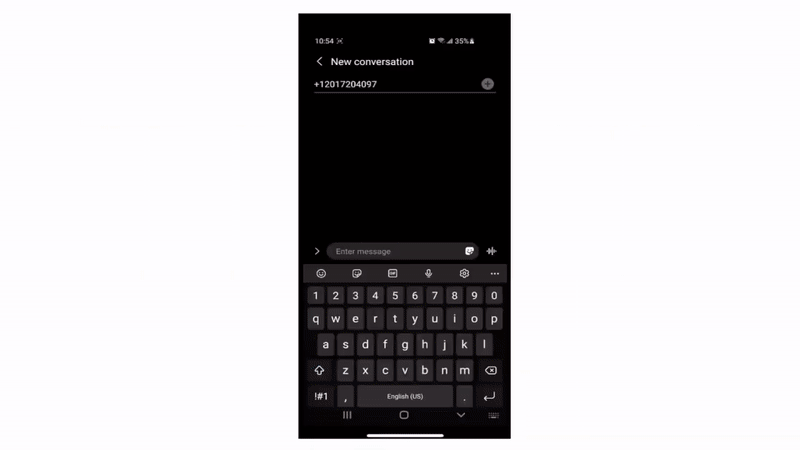

Platform that allows all Nova Scotians to interact, request/provide assistance in time of disasters without the need of internet through social and community interaction using SNS (Simple Notification Services)

## Challenge

- How might we create a solution to ensure that all Canadians are more resilient before, during, and/or after extreme weather events?

## Solution
- To create a platform that allows all Canadians to interact, request/provide assistance in time of disasters without the need of internet through social and community interaction using SNS (Simple Notification Services) .  This application will encourage community support and decrease the stress on first time responders during disasters or unexpected events.

## Demo

